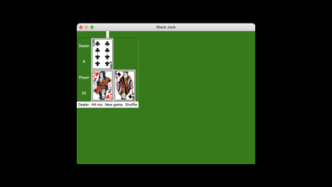

# Blackjack

This is the very famous poker “Blackjack”. In this game you will go up against the computer which is the dealer in this case. You along with the dealer will be dealt two cards, from there you will try to get the sum of both cards to 21 or close to 21. Whichever player is closet to 21 is declared the winner. In order to get to 21, you will have to say hit me or in this case click the “Hit me!” button. Once you are satisfied with your number and its 21 or lower, you will then click the “Dealer” button. This will then end you turn, and the dealer will now play, the player with the sum of cards closet to 21 is the winner.

This code comes with two items, one folder and one python file. The folder holds a list of card pictures that are “.png”. The modules that are used in this project are “Tkinter” and “Random”. 
The Tkinter module is used to create the GUI, which helps you play the game. 
The Random module is used to select random cards for each player.

An example of the coding running is below:

